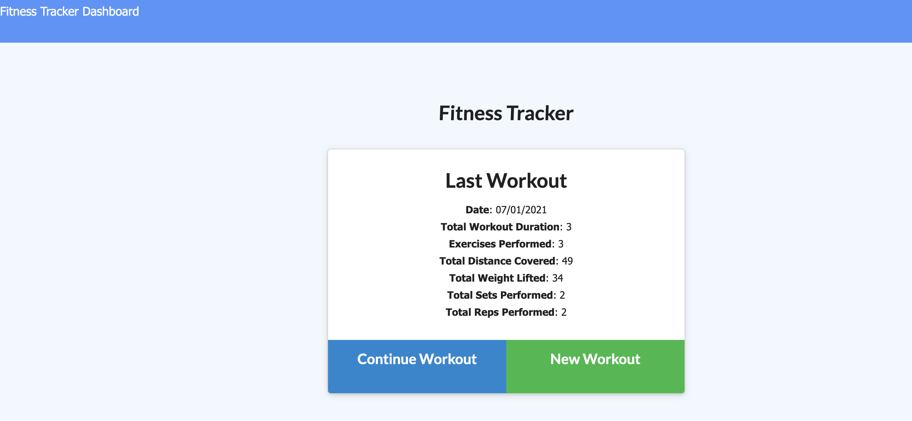
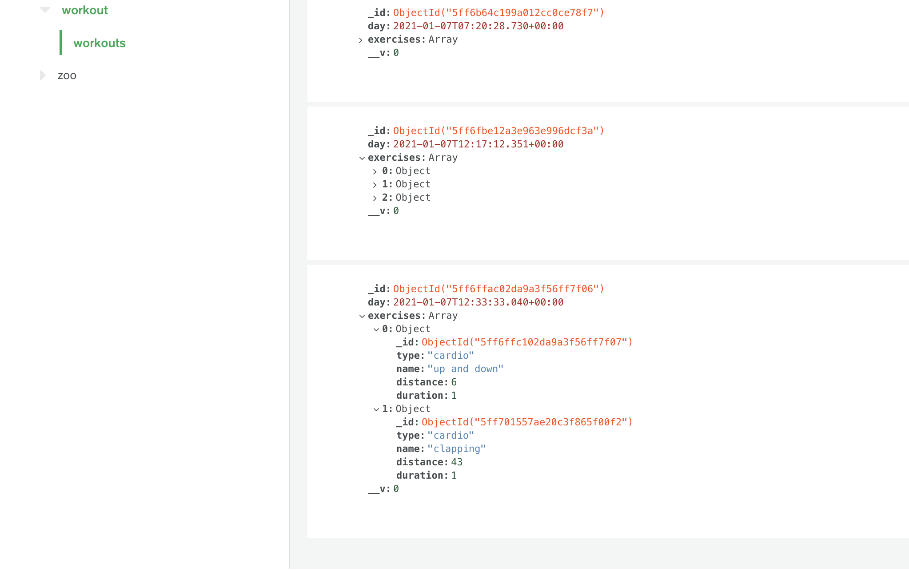

# Workout-tracker
This app helps the user keep the track of workout and plan further to keep up with the exercises.

## usage
To use this applicaton, git clone this repository, run 'npm init' and npm install to install the following dependencies:

- Express
- mongoose
- morgan

The app can be invoked using npm start or node server.js

## User Story
As a user, user can view, create and track daily workouts. User can log multiple exercises in a workout at a time. User will be able to track the name, type, weight,sets, reps and duration of exercise. 
## Links to the application
- Github repository link: ()
- Heroku deployed link; ()

## Screenshots

## Built With
- VS Code - (https://code.visualstudio.com/)
- Terminal
- Express
- Node

## License 
MIT License

## Author 
Manish Neupane  
Email: mrnish.are@gmail.com  
Github: https://github.com/ManNeu